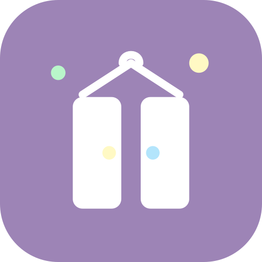

# Yakwa

Application Android native (Kotlin, Jetpack Compose, Room) pour gérer l'inventaire d'un
placard/cuisine, avec import assisté par scan de ticket de courses (CameraX + ML Kit OCR).
Tout est local sur l'appareil, sans backend.

## Identité visuelle

Le logo évoque le rangement de placard : un cintre au-dessus d'une armoire à deux portes,
dans les couleurs du design system Pastel Modern de l'app (violet doux, rose pastel,
crème, bleu bébé, menthe — voir `app/src/main/java/com/rangele/inventory/ui/theme/Color.kt`).
Le mark est appliqué à l'icône de lancement (adaptive icon) et à l'écran d'accueil pour une
identité cohérente dans toute l'app.

- `docs/branding/yakwa-logo.svg` — icône seule
- `docs/branding/yakwa-wordmark.svg` — icône + nom, pour un usage marketing

## Fonctionnalités (MVP)

- **Inventaire** : liste des produits en stock, triée du dernier ajouté au plus ancien par
  défaut (tri par nom ou par date de péremption au choix, menu « ⇅ »), avec recherche.
- **Ajout manuel** : nom, quantité, unité — avec détection de doublon (propose de fusionner
  avec un produit existant plutôt que de le dupliquer).
- **Retrait/ajustement** : +/- ou saisie directe de la quantité, suppression, depuis la liste.
- **Scan de ticket** : photo du ticket → OCR on-device (ML Kit) → extraction heuristique des
  lignes produit → écran de vérification (édition/suppression/fusion) → import dans l'inventaire.

## Structure

- `app/src/main/java/com/rangele/inventory/data` — Room (entité, DAO, base) et repository.
- `app/src/main/java/com/rangele/inventory/ocr` — reconnaissance de texte et heuristique de
  parsing de ticket.
- `app/src/main/java/com/rangele/inventory/ui` — écrans Compose (MVVM) et navigation.

## Build

```
./gradlew ktlintCheck   # lint Kotlin
./gradlew test          # tests unitaires
./gradlew assembleDebug # APK debug
```

Le pipeline `.github/workflows/build.yml` exécute ces trois étapes sur chaque push vers
`staging`/`main`. Le module a deux product flavors (`staging` et `production`, ce dernier
correspondant à `main`), donc chaque run publie les deux APK debug, quelle que soit la branche
à l'origine du push.

**Où récupérer les APK :**
- Onglet **Releases** du repo → `staging-latest` / `main-latest` : toujours le dernier build,
  c'est la page à utiliser pour télécharger l'APK.
- Onglet **Actions** → un run → artifacts en bas de page : copie horodatée par commit
  (`inventaire-placard-<env>-<sha court>`), expire au bout de 90 jours.

## Compatibilité

- `minSdk` 26 (Android 8.0) — `targetSdk`/`compileSdk` 35 (Android 15).
- `applicationId` : `com.rangele.inventory` (flavor `production`, celui qui correspond à `main` ;
  le flavor `staging` ajoute le suffixe `.staging` pour une installation séparée, voir
  `app/build.gradle.kts`).

## Permissions

| Permission | Usage |
| --- | --- |
| `CAMERA` (`android:required="false"` sur la feature caméra) | Photo du ticket de courses pour l'OCR (scan de ticket). |
| `INTERNET` | Uniquement pour interroger [Open Food Facts](https://openfoodfacts.org) (API de lecture publique, sans clé) lors d'un scan de code-barres, afin de préremplir le nom/la catégorie du produit. Aucun autre appel réseau : pas de backend, pas de compte, pas de télémétrie. |
| `POST_NOTIFICATIONS` (API 33+, demandée à l'exécution) | Notification locale quotidienne de péremption (WorkManager), activable/réglable dans Paramètres. |

## Versioning & releases

Chaque push sur `staging`/`main` publie une **release GitHub par build** (pas de tag partagé
écrasé à chaque fois) :
- tag `v<version>` avec `<version>` = `<appVersionBase>.<run_number>` (ex. `v1.0.25`) pour la branche `main` — release normale,
  marquée "Latest release" par GitHub.
- tag `staging-v<version>` pour la branche `staging` — pre-release.

Le run number GitHub Actions est injecté dans le build (`BUILD_NUMBER`) : il devient le `versionCode`
(strictement croissant à chaque release) et le dernier segment du `versionName` (`1.0.25`). La base
`1.0` se change dans `gradle.properties` (`appVersionBase`). En local, sans `BUILD_NUMBER`, le build
vaut `1.0.1` / `versionCode` 1.

**Mise à jour intégrée :** l'app (variant production) vérifie au lancement la dernière release `main`
et propose de l'installer ; première installation manuelle depuis la page Releases, puis plus rien à faire.

## Licence

GNU General Public License v3.0 (GPL-3.0) — voir [`LICENSE`](LICENSE).
